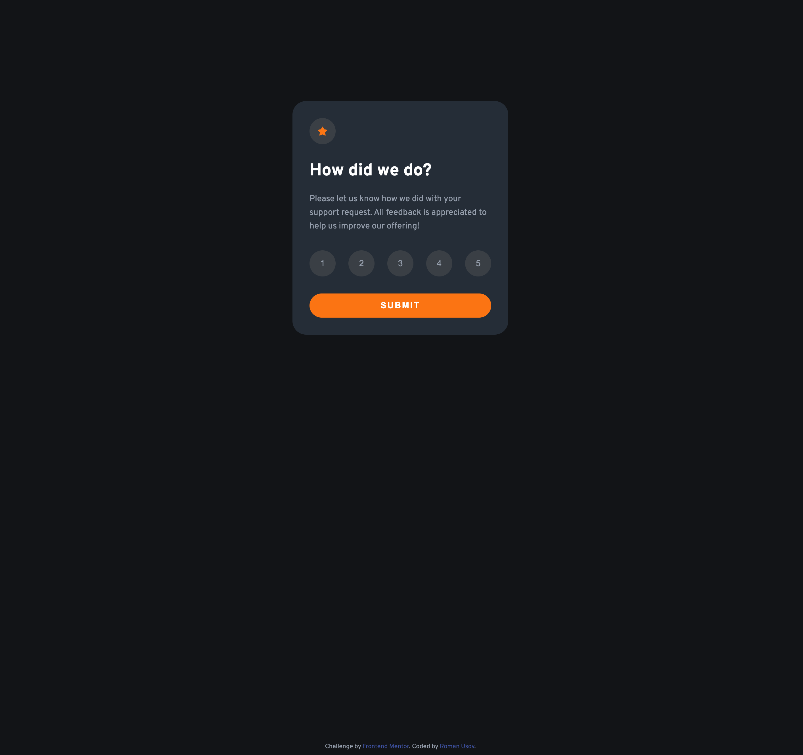

# Frontend Mentor - Interactive rating component solution

This is a solution to the [Interactive rating component challenge on Frontend Mentor](https://www.frontendmentor.io/challenges/interactive-rating-component-koxpeBUmI).

## Table of contents

- [Overview](#overview)
  - [The challenge](#the-challenge)
  - [Screenshot](#screenshot)
  - [Links](#links)
- [My process](#my-process)
  - [Built with](#built-with)
  - [What I learned](#what-i-learned)
  - [Continued development](#continued-development)
  - [Useful resources](#useful-resources)
- [Author](#author)
- [Acknowledgments](#acknowledgments)

**Note: Delete this note and update the table of contents based on what sections you keep.**

## Overview

### The challenge

Users should be able to:

- View the optimal layout for the app depending on their device's screen size
- See hover states for all interactive elements on the page
- Select and submit a number rating
- See the "Thank you" card state after submitting a rating

### Screenshot



### Links

- Solution URL: [Github](https://github.com/roman-usov/interactive-rating)
- Live Site URL: [Netlify](https://ru-interactive-rating.netlify.app/)

## My process

1. Developed the overall HTML structure
2. Created desktop styles for the rating form, including the states
3. Created desktop styles for the thank-you card
4. Wrote javascript code for selecting a rating, submitting it and displaying the thank-you card
5. Added a fade-in and a fade-out class to accompany the hidden class
6. Wrote javascript code that sets up an event listener for the transitionend event and enables the rating form to fade out first using transition and the thank-you card to fade-in

### Built with

- HTML5 & CSS3
- Flexbox
- Desktop-first workflow
- Javascript

### What I learned

1. Practiced creating a sticky footer
   For that:
   - created a parent container that houses the rating form and the thank-you card
   - turned the body into a flex container with the flex-direction set to column
   - allowed the parent container to grow

```css
body {
  display: flex;
  flex-direction: column;
}

.container-parent {
  flex: 1 0 auto;
}

.attribution {
  flex-shrink: 0;
}
```

2. Practiced creating a hidden class accompanied by a fade-in and a fade-out class to add a bit of smoothness `to the transition from the rating form to the thank-card

```js
ratingFormEl.addEventListener(
  'transitionend',
  (ev) => {
    ev.preventDefault();

    ratingFormEl.classList.add('out-of-flow');
    thankYouEl.classList.remove('out-of-flow');
    thankYouEl.classList.add('not-visible');
    thankYouEl.classList.add('fade-in');
  },
  {
    capture: false,
    once: true,
  }
);

ratingFormEl.classList.add('fade-out');
```

```css
 .out-of-flow {
  display: none;
  pointer-events: none;
}

.not-visible {
  opacity: 0;
  visibility: hidden;
}

.fade-out {
  opacity: 0;
  visibility: hidden;
  transition-property: visibility, opacity;
  transition-duration: 0.3s;
  transition-timing-function: ease-in-out;
}

.thank-you-content.fade-in {
  visibility: visible;
  opacity: 1;
  transition-property: visibility, opacity;
  transition-duration: 0.3s;
  transition-timing-function: ease-in-out;
}
```
3. Learned that arbitrarily using 'all' with the transition property can result in unwanted too elastic switching from the desktop view to the mobile view

4. Learned about the transitionend event that allows working around the display: none not supporting transitions

To see how you can add code snippets, see below:

```html
<h1>Some HTML code I'm proud of</h1>
```
```css
.proud-of-this-css {
  color: papayawhip;
}
```
```js
const proudOfThisFunc = () => {
  console.log('🎉')
}
```

If you want more help with writing markdown, we'd recommend checking out [The Markdown Guide](https://www.markdownguide.org/) to learn more.

**Note: Delete this note and the content within this section and replace with your own learnings.**

### Continued development

Use this section to outline areas that you want to continue focusing on in future projects. These could be concepts you're still not completely comfortable with or techniques you found useful that you want to refine and perfect.

**Note: Delete this note and the content within this section and replace with your own plans for continued development.**

### Useful resources

- [Example resource 1](https://www.example.com) - This helped me for XYZ reason. I really liked this pattern and will use it going forward.
- [Example resource 2](https://www.example.com) - This is an amazing article which helped me finally understand XYZ. I'd recommend it to anyone still learning this concept.

**Note: Delete this note and replace the list above with resources that helped you during the challenge. These could come in handy for anyone viewing your solution or for yourself when you look back on this project in the future.**

## Author

- Website - [Add your name here](https://www.your-site.com)
- Frontend Mentor - [@yourusername](https://www.frontendmentor.io/profile/yourusername)
- Twitter - [@yourusername](https://www.twitter.com/yourusername)

**Note: Delete this note and add/remove/edit lines above based on what links you'd like to share.**

## Acknowledgments

This is where you can give a hat tip to anyone who helped you out on this project. Perhaps you worked in a team or got some inspiration from someone else's solution. This is the perfect place to give them some credit.

**Note: Delete this note and edit this section's content as necessary. If you completed this challenge by yourself, feel free to delete this section entirely.**
